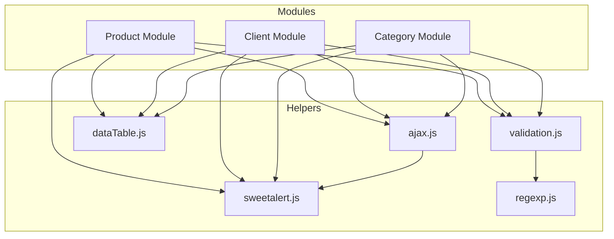

# Implementación y Flujo de Módulos

Este documento detalla cómo se implementan los módulos principales (`product`, `client`, `category`) utilizando los helpers definidos en la aplicación.

## Estructura General

Cada módulo sigue una arquitectura consistente dividida en dos archivos principales:

1.  **`[modulo]DataTable.js`**: Maneja la lógica de la tabla, interacción con la API (AJAX), y eventos del DOM (modales, botones).
2.  **`[modulo]Validation.js`**: Maneja la validación de formularios en tiempo real y al enviar.

## Módulos

### 1. Producto (`src/assets/js/product`)

Este es el módulo más complejo debido al manejo de imágenes y múltiples campos numéricos.

- **Archivos**: `productDataTable.js`, `productValidation.js`
- **Características Clave**:
  - **Carga de Imágenes**: Utiliza `FormData` para enviar archivos al servidor.
  - **Previsualización**: Usa `imagePreview.js` para mostrar la imagen seleccionada antes de subirla.
  - **Validación Compleja**: Valida stock (no negativo), precios (mayor a 0), y campos obligatorios.
  - **Manejo de Errores**: Muestra errores específicos si la carga de la tabla falla.

### 2. Cliente (`src/assets/js/client`)

Módulo estándar para gestión de personas.

- **Archivos**: `clientDataTable.js`, `clientValidation.js`
- **Características Clave**:
  - **Validaciones Específicas**: Usa expresiones regulares para Cédula, Email y Teléfono.
  - **Datos JSON**: Envía datos como objeto JSON simple (no requiere `FormData`).

### 3. Categoría (`src/assets/js/category`)

El módulo más simple, ideal como referencia base.

- **Archivos**: `categoryDataTable.js`, `categoryValidation.js`
- **Características Clave**:
  - **Minimalista**: Solo valida el nombre.
  - **CRUD Básico**: Operaciones directas sin lógica de negocio compleja.

## Flujo de Datos y Ejecución

### 1. Carga Inicial (Read)

El flujo al cargar la página es:

1.  **Skeleton**: Se muestra un esqueleto de carga (`showSkeleton`) en el contenedor de la tabla.
2.  **DataTable**: Se inicializa DataTables (`createDataTable`).
3.  **AJAX**: DataTables hace una petición `POST` automática a la API con `{ getAll: true }`.
4.  **Render**:
    - Si hay datos: Se oculta el skeleton (`hideSkeleton`) y se anima la entrada de la tabla (`animateIn`).
    - Si hay error: Se muestra un mensaje de error en la tabla.

### 2. Creación / Edición (Create/Update)

El flujo al interactuar con formularios:

1.  **Apertura**: Al abrir el modal, se resetea el formulario y se limpian validaciones visuales.
2.  **Interacción**:
    - El usuario escribe en los inputs.
    - **Validación en Tiempo Real**: `[modulo]Validation.js` escucha eventos `input` o `change`.
    - Se usa `validation.js` para verificar reglas (regex).
    - Se actualiza la clase visual (`is-valid` / `is-invalid`) y el estado del botón "Guardar".
3.  **Envío (Submit)**:
    - Se previene el envío por defecto (`e.preventDefault()`).
    - **Verificación Final**: Se comprueba si hay errores pendientes.
    - **Loading**: Se muestra alerta de carga (`showLoading`).
    - **AJAX**: Se llama a `create()` o `update()` de `ajax.js`.
4.  **Respuesta**:
    - **Éxito**: Cierra loading, muestra alerta de éxito (`showSuccessMessage`), cierra modal, y recarga la tabla (`reloadDataTable`).
    - **Error**: Cierra loading, muestra alerta de error (`showErrorMessage`).

### 3. Eliminación (Delete)

El flujo al eliminar un registro:

1.  **Click**: Usuario hace clic en botón eliminar.
2.  **Confirmación**: Se muestra alerta de confirmación (`showConfirm`).
    - Si cancela: No pasa nada.
    - Si confirma: Procede.
3.  **AJAX**: Se llama a `remove()` de `ajax.js`.
4.  **Actualización**: Al completarse, se recarga la tabla (`reloadDataTable`).

## Diagrama de Dependencias

